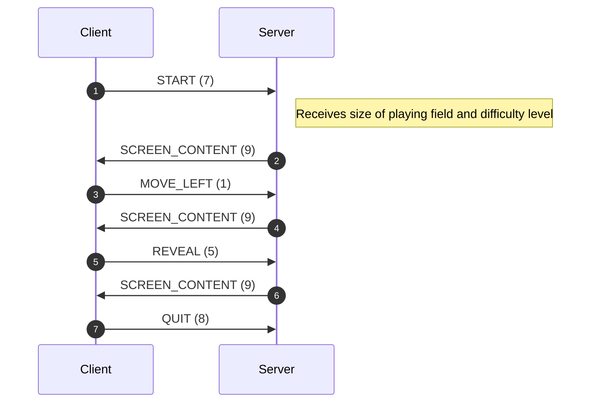

# Introduction

Voipfuture management has just decided to diversify our business and enter the gaming industry which has been soaring to new heights lately.

It was decided to start out with a rather basic but popular game that is guaranteed to rake in big $$$ once we start adding microtransactions and vanity items.
The game will be called... JMinesweeper !

# General Requirements

- client-server architecture
- ~~to thwart competitors~~ for performance reasons a proprietary binary network protocol will be used for communication between clients and the server
- we're kind of low on development resources so instead of the initially planned immersive VR experience using the latest version of Unity we took inspiration from Dwarf Fortress and decided to build an ANSI terminal version instead.

# Networking Protocol

The network protocol is TCP-based and uses an 8-bit packet type ID that (assuming the packet type supports additional payload data)
is followed by a 32-bit payload length field in big-endian byte order followed by any payload bytes.

| Offset | Field length (bytes) | Field Description                                                                                        |
|--------|----------------------|----------------------------------------------------------------------------------------------------------|
| 0      | 1                    | Packet type ID                                                                                           |
| 1      | 4                    | (only present when packet type supports payload data) payload byte count                                 |
| 5      | variable             | (only present when packet type supports payload data and payload length field was non-zero) payload data |

The following packet types are being used:

| Type ID | NetworkPacketType enum name | Description                                                                 | Payload                                                                                                           |
|---------|-----------------------------|-----------------------------------------------------------------------------|-------------------------------------------------------------------------------------------------------------------|
| 1       | MOVE_LEFT                   | Move cursor left by one cell                                                | NONE                                                                                                              |
| 2       | MOVE_RIGHT                  | Move cursor right by one cell                                               | NONE                                                                                                              |
| 3       | MOVE_UP                     | Move cursor up by one cell                                                  | NONE                                                                                                              |
| 4       | MOVE_DOWN                   | Move cursor down by one cell                                                | NONE                                                                                                              |
| 5       | REVEAL                      | Reveal the cell below the current cursor position                           | NONE                                                                                                              |
| 6       | TOGGLE_BOMB_MARK            | Toggle marking the cell at the current cursor position as containing a bomb | NONE                                                                                                              |
| 7       | START                       | Start a new game                                                            | 3 bytes. byte 0 - playing field columns byte 1 - playing field rows byte 2 - difficulty level (1,2 or 3) |
| 8       | QUIT                        | Quit                                                                        | NONE                                                                                                              |
| 9       | SCREEN_CONTENT              | Current screen content                                                      | Variable length, screen content as a UTF-8 string                                                                 |
| 10      | TOGGLE_DEBUG_MODE           | Toggle debug mode                                                           | NONE                                                                                                              |

The protocol uses TCP port 9999. When receiving a valid packet, the server will execute the associated action and then respond with a type 9 packet (Current Screen Content) that holds current the screen content.
This does **not** apply to packet type 9 (Quit) though as the server will immediately close the connection after receiving it.
If the server receives a command that is not compatible with the current game state (like trying to move the cursor although the player has already lost the current game), it
will not perform the associated action and simply respond with the current screen content.

# Client Requirements

- JDK 20 command-line console application running on Linux
- needs to support specifying the remote server name/address as well as the game's playing field size (in rows and columns) and the desired difficulty level via command-line options    

    | Option      | Description                          |
    |-------------|--------------------------------------|
    | -r,--rows   | Height of playing field (1...255)    |
    | -c,-columns | Width  of playing field (1...255)    |
    | -l,--level  | Difficulty level (1,2 or 3)          |
    | -h,--help   | Explain supported commandline syntax |
 
- needs to ask the user for the desired playing field size as well as game difficulty
- needs to ship with a simple Bash script named run_client.sh that starts the client and passes any command-line options on to the client as well as starting
  the client using default settings (20x10 playing field, difficulty level 1, server 127.0.0.1) when no command-line options are given
- needs an ANSI terminal emulation to work correctly (set foreground/background colors, move cursor etc.)
- connects to server via TCP port 999
- needs to implement the network protocol as outlined above
- needs to print any screen content received from the server to the current console
- needs to switch the console to unbuffered mode (so single key presses can be read) and disable local echo (so any key presses while playing the game are not actually rendered)
- uses  the following keyboard keys to control the game:    
      | Key    | Action                             |
      |--------|------------------------------------|
      | w      | Move cursor up                     |
      | a      | Move cursor left                   |
      | s      | Move cursor down                   |
      | d      | Move cursor right                  |
      | TAB    | Start a new game                   |
      | SPACE  | Toggle bomb mark at cursor position|
      | RETURN | Reveal cell at cursor position     |
      | X      | Quit game                          |
      | #      | Toggle debug mode                  |

# Server Requirements

- JDK20 Java command-line application running on Linux
- needs to ship with a simple Bash script named run_server.sh that starts the server
- need to implement the network protocol as outlined above
- needs to implement minesweeper game logic as outlined below, supporting a playing field size between 1x1 and 255x255 cells as well as three difficulty levels (easy,medium,hard) 
- needs to be able to handle multiple clients at the same time 
- with the game being a console game, the following characters should be used to indicate the state of a game cell.    

    | Character(s) | Meaning                                                            |
    |--------------|--------------------------------------------------------------------|
    | B            | Bomb                                                               |
    | ?            | Cell hidden/not yet revealed                                       |
    | .            | Empty cell                                                         |
    | `<digit>`    | Total number of bombs within the eight cells adjacent to this cell |

# Minesweeper gameplay rules

The game is played on a rectangular playing field with X*Y cells. Each cell may or may not contain a "bomb". When a new game starts, all cell contents are hidden
from the player.

The game supports three difficulty levels:

| Level  | Percentage of cells containing a bomb |
|--------|---------------------------------------|
| EASY   | 5%                                    |
| MEDIUM | 25%                                   |
| HARD   | 45%                                   |

The player can select a cell to reveal and depending on the cells content the following will happen:

1. Cell contains a bomb  
    The game immediately ends and the player has lost. The server will now reveal the full playing field to the player, showing the location of all bombs  
    overlayed by any bomb markers the player may have placed (in a way that both the bomb marker and any bomb at that location are clearly discernible)  
    
2. The cell does not contain a bomb but at least one of the eight cells adjacent to it contains a bomb  
    The current cell is revealed, showing the number of bombs in the eight cells surrounding it, and the server 
    awaits the next player action.  
   
3. The cell does not contain a bomb and all eight cells adjacent to it do not contain any bomb  
    The game will performs a depth-first flood-fill by always recursively visiting the cells directly above/below/left/right 
    the current cell and will stop exploring a given direction (continuing with the previous cell instead) as soon as either  
        - a cell containing a bomb is discovered or  
        - a cell that is adjacent to a cell containing a bomb is discovered, and it has not already been revealed by the user during some previous action
   

If the player tries to reveal a cell that has cell has already been revealed before, nothing happens. 

The game reaches a terminal state when the player either 

- reveals a cell that holds a bomb (player loses) **or**  
    
- has marked all cells containing a bomb and no other cells (player wins)  
    

After the game reaches a terminal state, the server will ignore any further actions sent by the client unless it is 
either a START telling the server to being a new game or a QUIT telling the server to disconnect the client. 
